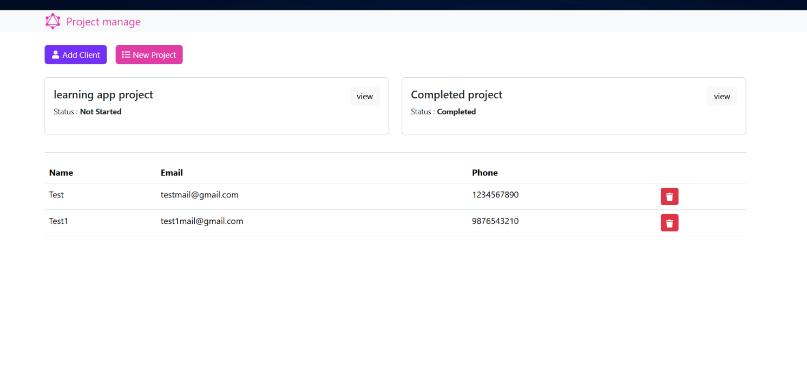

# MERN + GraphQL Client/Project Tracker

An Express + GraphQL (`express-graphql`) API backed by MongoDB/Mongoose, with a Create React App + Apollo Client frontend for managing clients and their projects.

- **Server**: `server/` — GraphQL endpoint at `http://localhost:5000/graphql` (GraphiQL UI enabled when `NODE_ENV=development`)
- **Client**: `client/` — React app at `http://localhost:3000`, talks to the server via Apollo Client (`client/src/App.js`, hardcoded to `http://localhost:5000/graphql`)



You can run this **fully locally**, or **via Docker**. For the database, use either a **local MongoDB / Compass**, or the **MongoDB container** from Docker Compose — pick one per option below.

## Option A — Run everything locally

### 1. Database: local MongoDB (Compass)

- Install and start MongoDB Community Server (Compass is just the GUI on top of it — install it too if you want to browse data).
- Make sure `mongod` is running on the default port `27017`.

### 2. Configure environment variables

Create `server/.env` (or `.env` at repo root, both are read via `dotenv` from `server/index.js`) using `.env.example` as a reference:

```
PORT=5000
NODE_ENV=development
MONGO_URI=mongodb://127.0.0.1:27017/mern-graphql
```

### 3. Install and run the server

```bash
npm install
npm run dev      # nodemon, auto-restart
# or
npm start        # plain node
```

Server runs on `http://localhost:5000`, GraphiQL at `http://localhost:5000/graphql`.

### 4. Install and run the client

```bash
cd client
npm install
npm start
```

Client runs on `http://localhost:3000`.

## Option B — Run everything with Docker

This spins up three containers: `mongo`, `server`, `client`.

```bash
docker compose up --build
```

- Client: [http://localhost:3000](http://localhost:3000)
- Server / GraphiQL: [http://localhost:5000/graphql](http://localhost:5000/graphql)
- Mongo: `mongodb://localhost:27017` (also reachable from other containers as `mongo:27017`)

Stop and remove containers:

```bash
docker compose down
```

Stop and also wipe the Mongo data volume:

```bash
docker compose down -v
```

Run in the background:

```bash
docker compose up --build -d
docker compose logs -f
```

## Option C — Mix: local server/client + Dockerized MongoDB only

Useful if you want fast local dev reload but don't want to install MongoDB natively.

```bash
docker run -d --name mern-graphql-mongo -p 27017:27017 -v mern-graphql-mongo-data:/data/db mongo:7
```

Then set in your `.env`:

```
MONGO_URI=mongodb://127.0.0.1:27017/mern-graphql
```

And run the server/client locally as in Option A, steps 3–4.

## Environment variables

| Variable    | Used by | Description                                                                 |
|-------------|---------|-------------------------------------------------------------------------------|
| `PORT`      | server  | Port the Express/GraphQL server listens on (default `5000`)                  |
| `NODE_ENV`  | server  | `development` enables the GraphiQL UI at `/graphql`                          |
| `MONGO_URI` | server  | Mongoose connection string — point at local Mongo or the `mongo` container   |

See `.env.example` for a starting point.

## Notes

- The client's Apollo URI is hardcoded to `http://localhost:5000/graphql` (`client/src/App.js`), so the server must be reachable at that address from wherever the browser runs.
- No lint/test scripts are defined at the repo root. The client has CRA's Jest setup: `cd client && npm test`.
